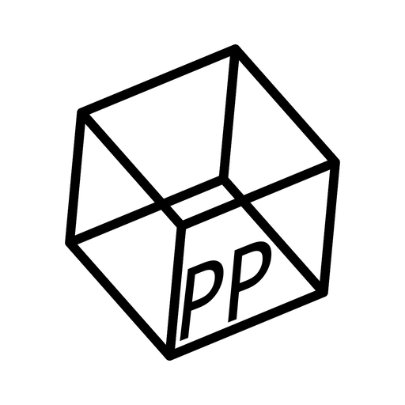

## Maintainer
Open source projects primarily created and maintained by me.

::: {.project}
### PDF Stitcher

::: {style="float: left; margin-right: 1em;"}
[{width=75 fig-alt="https://pdfstitcher.org/"}](https://pdfstitcher.org/)
::: 

A cross-platform utility for adapting PDF sewing patterns for projectors. PDFStitcher performs page assembly and cropping, and also allows for selectively changing line properties in different layers or removing layers altogether for easier import into Inkscape.

This project is fairly stable and has not undergone active development for some time. This is in large part due to widespread production of projector-ready patterns, as well as the introduction of more accessible web apps such as [Pattern Projector](https://www.patternprojector.com). I consider it a success that PDF Stitcher is no longer a necessary part of the projector sewing workflow!
:::

::: {.project}
### PDF Mangler

::: {style="float: left; margin-right: 1em;"}
[{width=75 fig-alt="https://github.com/cfcurtis/pdf-mangler"}](https://github.com/cfcurtis/pdf-mangler)
::: 

A Python library to anonymize and obfuscate the contents of a PDF, producing a version that retains the structure and can be used for debugging without violating usage agreements.
:::

::: {.project}
### Foundations of Python Programming: Functions First
::: {style="float: left; margin-right: 1em;"}
[{width=75 fig-alt="https://github.com/Python-FunctionsFirst/fopp-functions-first"}](https://github.com/Python-FunctionsFirst/fopp-functions-first)
:::
An adaptation of the open source "Foundations of Python Programming" on the [Runestone Academy](https://runestone.academy) platform, specifically tailored for COMP 1701. This project was funded by the Mount Royal Library’s Open Education Adaptation Grant, with much of the work done by Matthew Hrehirchuk.

Control of this project has since been handed over to Dr. Sara-Lynn Gopalkrishna at George Mason University.
:::

## Contributor
I contribute tiny bits here and there to a number of projects, but here are some that I have worked on more substantially.

::: {.project}
### Inkscape
::: {style="float: left; margin-right: 1em;"}
[{width=75 fig-alt="https://inkscape.org/"}](https://inkscape.org/)
:::
Inkscape is a free and open source vector graphics editor for GNU/Linux, Windows and macOS. It offers a rich set of features and is widely used for both artistic and technical illustrations such as cartoons, clip art, logos, typography, diagramming and flowcharting.

I primarily work on PDF functionality, but have joined the development team and contribute elsewhere where possible.
:::

::: {.project}
### Pattern Projector
::: {style="float: left; margin-right: 1em;"}
[{width=75 fig-alt="https://www.patternprojector.com/"}](https://www.patternprojector.com/)
:::
Pattern projector is a free and open source web app that quickly calibrates projectors for sewing patterns. It also has tools for stitching together multiple page patterns, changing line thickness, inverting colors, flipping/rotating patterns, and more.

My main contribution was adding the ability to save a "stitched" PDF.
:::